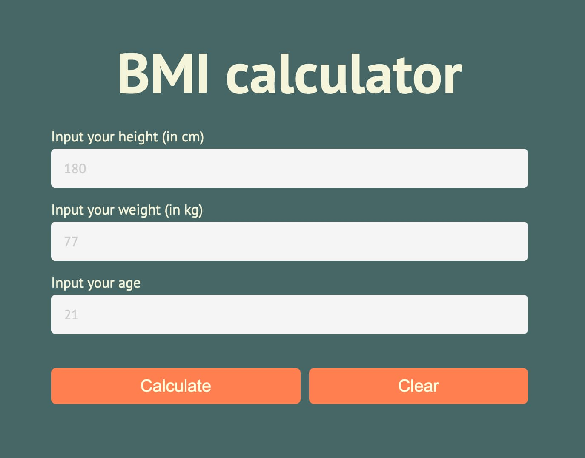
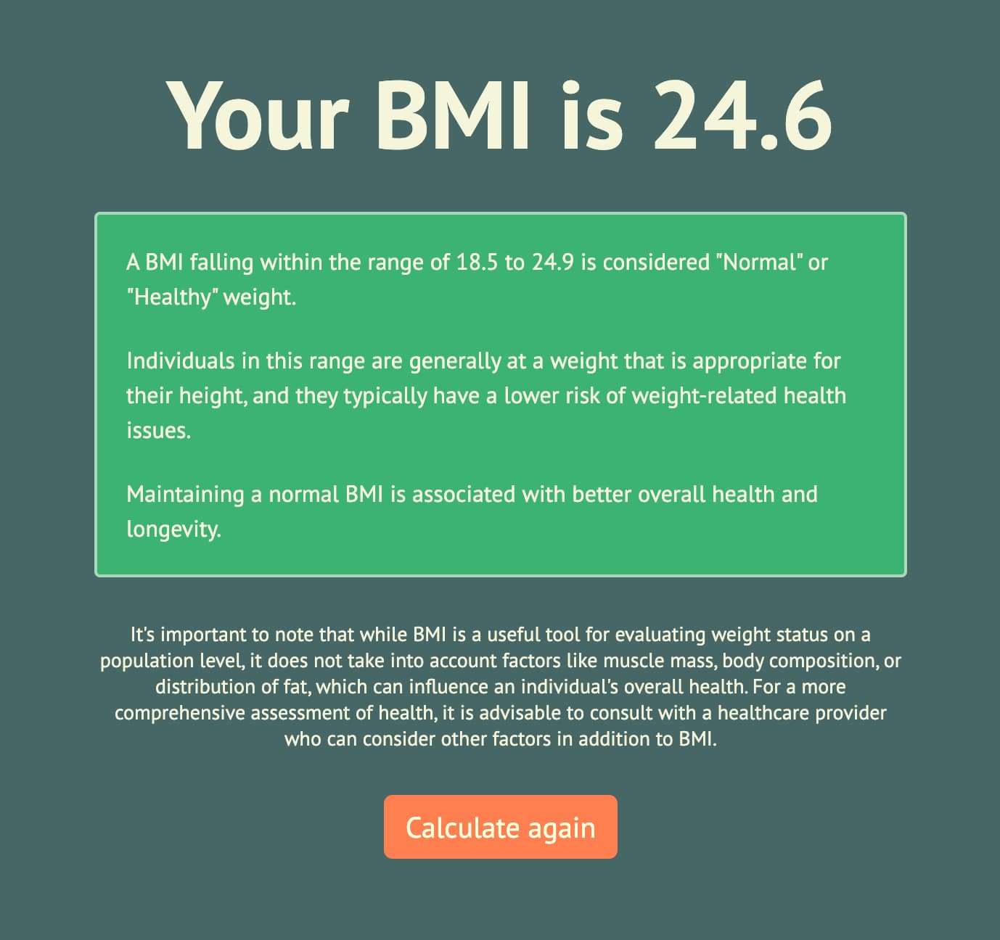

# BMI Calculator

A simple Body Mass Index (BMI) calculator built with React.

## Description

The BMI Calculator is a web application that allows users to calculate their BMI based on their height, weight, and age. It helps users determine whether their body mass falls within the underweight, normal, overweight, or obese range.

## Features

- Input fields for height, weight, and age.
- Real-time error validation for input fields.
- Calculation of BMI.
- BMI result categorization.
- Option to clear the input fields.
- Navigation to view the BMI results.

## How to Use

1. **Input Fields:**

   - Enter your height in centimeters.
   - Enter your weight in kilograms.
   - Enter your age in years.

2. **Validation:**

   - Real-time validation is performed on the input fields to ensure that the provided data is valid.
   - Validation includes checking for numeric input and acceptable ranges for height, weight, and age.

3. **Calculating BMI:**

   - Click the "Calculate" button to calculate your BMI based on the provided data.
   - The application categorizes your BMI result as underweight, normal, overweight, or obese.

4. **Clear Input:**
   - You can clear the input fields and results by clicking the "Clear" button.

## Technologies Used

- React
- React Router
- CSS (Styling)

## Installation

1. Clone this repository to your local machine.
2. Navigate to the project directory.
3. Install dependencies using `npm install`.
4. Start the development server using `npm start`.

## Contributions

Contributions to the project are welcome. You can submit issues, suggest enhancements, or open pull requests.

## License

This project is open-source and available under the [MIT License](LICENSE).

## Credits

- Created by Dmitriy Chastukhin
- BMI Formula: [BMIformula.js](src/data/formulas.js)

## Created with Create React App

This project was bootstrapped with [Create React App](https://create-react-app.dev/).
